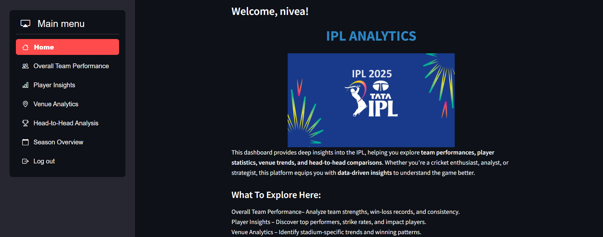
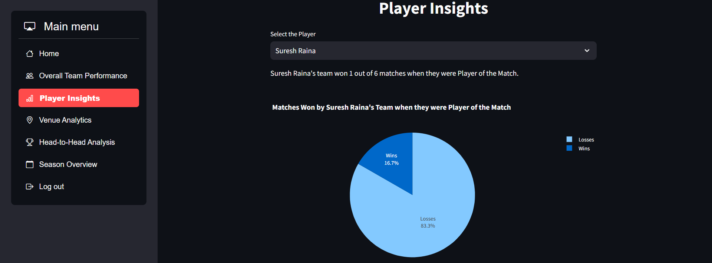
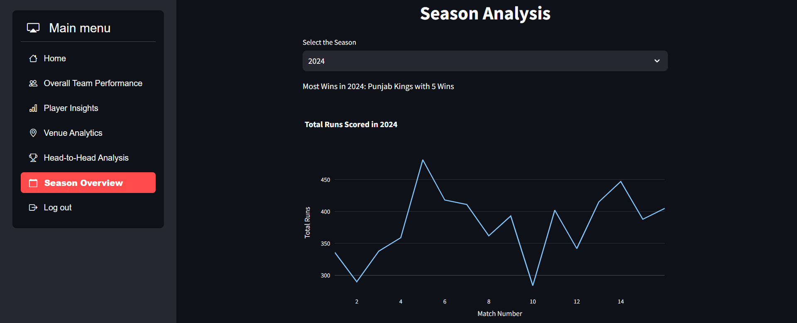

# IPL-ANALYTICS

This project is a comprehensive data analytics platform for exploring and analyzing Indian Premier League (IPL) cricket data. It leverages historical match and player statistics to generate insightful visualizations, performance trends, and data-driven comparisons.

---

# Features

-  **Match Analysis** – View match-level stats including toss decisions, win margins, and results.
-  **Player Insights** – Analyze batting, bowling, and fielding statistics across seasons.
-  **Team Performance** – Compare teams head-to-head, by venue, and over time.
-  **Season Overview** – Identify top performers, consistent players, and milestones.
-  **Interactive Visualizations** – Explore trends using charts and plots powered by Plotly and Matplotlib.

---

# Tech Stack

- **Frontend**: Streamlit
- **Data Processing**: Pandas
- **Visualization**: Plotly
- **Deployment**: Local / Streamlit Cloud
- **Data Source**: IPL dataset [Self Developed]

---

#  Goals

- Help fans and analysts understand IPL trends
- Offer predictive and comparative tools for teams and players
- Present stats in a clean, accessible format for both casual and serious cricket followers

---

# Screenshots

### Home Dashboard

### Player Performance

### Season Summary

